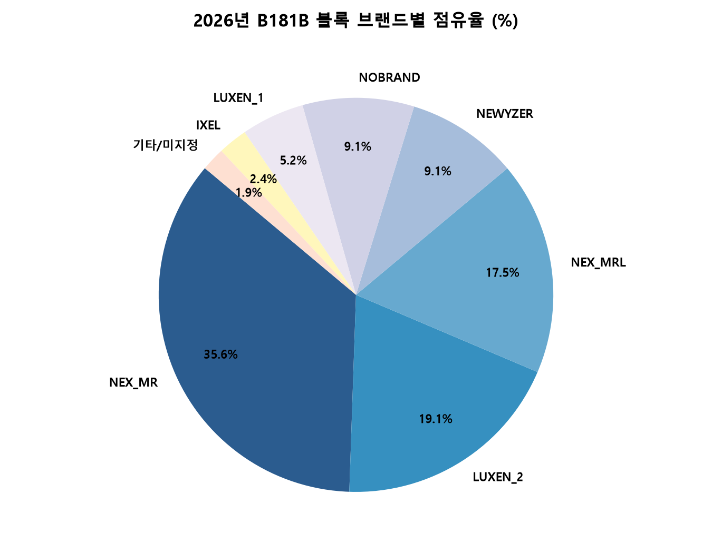
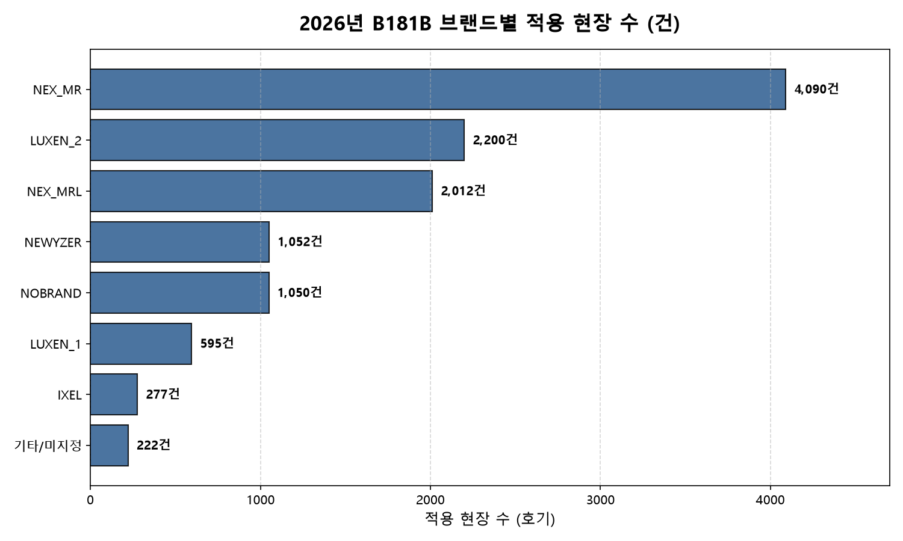
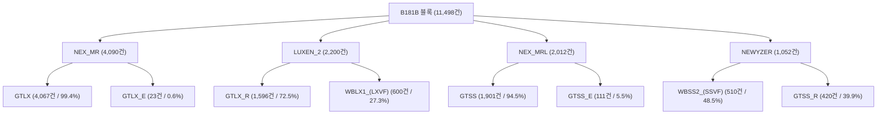

# 2026년 릴리즈 제품 B181B 블록 브랜드별 분석 통계 보고서

> [!NOTE]
> 본 보고서는 2026년 릴리즈된 엘리베이터 제품(`MD$STATUS = 'RLS'`) 중 **`B181B` (SUBWEIGHT / 서브웨이트)** 블록 자재를 사용하는 현장의 브랜드별·기종별 적용 통계를 추출하고 시각화한 종합 통계 보고서입니다.

---

## 1. 개요 및 주요 지표 (Executive Summary)

### 📊 핵심 요약 지표 (KPI)

| 지표 항목 | 측정값 | 비고 |
|:---|:---:|:---|
| **총 적용 현장 수** | **11,498 개 호기** | 2026년 릴리즈(`RLS`) 제품 기준 |
| **분석 대상 블록** | **B181B** | SUBWEIGHT (카/CWT 서브웨이트 블록) |
| **최다 적용 브랜드** | **NEX_MR** | **4,090 건 (35.57%)** |
| **TOP 3 브랜드 합계** | **8,302 건** | **전체 현장의 72.20% 점유** |
| **최다 적용 자재** | **18110414G9100** | SS400, 30kg (4,289 개 현장 적용) |

---

## 2. 브랜드별 적용 현황 및 시각화 차트

### 2.1 브랜드별 점유율 (Pie Chart)

---

### 2.2 브랜드별 적용 현장 수 비교 (Bar Chart)

---

### 2.3 브랜드별 상세 통계표

> [!TIP]
> 점유율 상위 3개 브랜드(`NEX_MR`, `LUXEN_2`, `NEX_MRL`)가 전체 수요의 **70% 이상**을 견인하고 있습니다.

| 순위 | 브랜드 코드 (`EL_ABRAND`) | 적용 현장 수 (호기) | 비율 (%) | 누적 비율 (%) | 주요 적용 기종 (`EL_ATYP`) |
|:---:|:---|:---:|:---:|:---:|:---|
| **1** | **NEX_MR** | **4,090** | **35.57%** | 35.57% | `GTLX` (4,067건), `GTLX_E` (23건) |
| **2** | **LUXEN_2** | **2,200** | **19.13%** | 54.70% | `GTLX_R` (1,596건), `WBLX1_(LXVF)` (600건) |
| **3** | **NEX_MRL** | **2,012** | **17.50%** | 72.20% | `GTSS` (1,901건), `GTSS_E` (111건) |
| **4** | **NEWYZER** | **1,052** | **9.15%** | 81.35% | `WBSS2_(SSVF)` (510건), `GTSS_R` (420건) |
| **5** | **NOBRAND** | **1,050** | **9.13%** | 90.48% | `WBST1_(STVF)` (507건), 미지정 (316건) |
| **6** | **LUXEN_1** | **595** | **5.17%** | 95.65% | `GTLX_R` (470건), `WBLX1_(LXVF)` (125건) |
| **7** | **IXEL** | **277** | **2.41%** | 98.06% | `WBHS_(HSVF)` (276건), `HSVF` (1건) |
| **8** | **미지정 / 기타** | **200** | **1.74%** | 99.80% | 미지정 (185건) 등 |
| **9** | **THEEL** | **13** | **0.11%** | 99.91% | `SUVF` (13건) |
| **10** | **NEO_MRL** | **8** | **0.07%** | 99.98% | `GTSS_R` (5건), `WBSS2_(SSVF)` (2건) |
| **11** | **SPACESAVER** | **1** | **0.01%** | 100.00% | `WBSS1_(SSVF)` (1건) |
| **합계** | **전체** | **11,498** | **100.00%** | **100.00%** | - |

---

## 3. 브랜드 및 주요 기종(Gi-Song) 세부 구성

### 3.1 주요 브랜드별 기종 상세 분포

> [!IMPORTANT]
> `NEX_MR` 브랜드에서는 `GTLX` 기종이 **99.4%**를 차지하며 단일 기종 집중도가 매우 높게 나타납니다.

- **NEX_MR** (총 4,090건)
  - `GTLX`: 4,067건 (99.44%)
  - `GTLX_E`: 23건 (0.56%)

- **LUXEN_2** (총 2,200건)
  - `GTLX_R`: 1,596건 (72.55%)
  - `WBLX1_(LXVF)`: 600건 (27.27%)
  - `WBLX_US`: 3건 (0.14%)
  - 기타: 1건 (0.05%)

- **NEX_MRL** (총 2,012건)
  - `GTSS`: 1,901건 (94.48%)
  - `GTSS_E`: 111건 (5.52%)

- **NEWYZER** (총 1,052건)
  - `WBSS2_(SSVF)`: 510건 (48.48%)
  - `GTSS_R`: 420건 (39.92%)
  - `WBSS_US`: 55건 (5.23%)
  - `WBHS_(SSVF)`: 50건 (4.75%)
  - 기타: 17건 (1.62%)

---

## 4. B181B 블록 내 주요 적용 자재 (TOP 10)

`B181B` 블록에 포함된 서브웨이트(SUBWEIGHT) 자재 중 2026년 릴리즈 현장에 가장 많이 배정된 **TOP 10 자재**입니다.

### 4.1 자재 상세 목록표

| 순위 | 자재번호 (`PARTNO`) | 자재명 (`PARTNAME`) | 규격 및 사양 (`SPEC`) | 적용 현장 수 |
|:---:|:---|:---|:---|:---:|
| **1** | `18110414G9100` | SUBWEIGHT | `SS400,30kg` | **4,289** |
| **2** | `18110412G2100` | SUBWEIGHT | `CONCRETE,30kg` | **1,118** |
| **3** | `18110414G1700` | SUBWEIGHT | `SS400,30kg` | **1,003** |
| **4** | `18110825G4100` | SUBWEIGHT | `CONCRETE(5.2),40kg,G/S` | **748** |
| **5** | `C18110825G2700` | SUBWEIGHT | `CONCRETE(5.2),30kg,G/S` | **695** |
| **6** | `18110824G410A` | SUBWEIGHT | `CONCRETE(3.2),30kg` | **449** |
| **7** | `18110414G2100` | SUBWEIGHT | `SS400,30kg` | **447** |
| **8** | `C18110824G270A` | SUBWEIGHT | `CONCRETE(3.2),30kg,G/S` | **410** |
| **9** | `VC003831G9300` | SUBWEIGHT | `SS400,20kg` | **405** |
| **10** | `18110413G0900` | SUBWEIGHT | `FC,30kg` | **376** |

---

## 5. 생성 파일 및 다운로드 안내

수행된 DB 조회 쿼리와 결과 데이터 집계 파일은 아래 경로에 저장되어 있습니다.

### 📁 시각화 차트 이미지 파일 (PNG / SVG)
- **브랜드 점유율 파이 차트**:
  - PNG: [`images/b181b_brand_pie_chart.png`](file:///d:/Antigravity_workspace/myLogicAgent/images/b181b_brand_pie_chart.png)
  - SVG: [`images/b181b_brand_pie_chart.svg`](file:///d:/Antigravity_workspace/myLogicAgent/images/b181b_brand_pie_chart.svg)
- **브랜드 적용 현장 수 막대 차트**:
  - PNG: [`images/b181b_brand_bar_chart.png`](file:///d:/Antigravity_workspace/myLogicAgent/images/b181b_brand_bar_chart.png)
  - SVG: [`images/b181b_brand_bar_chart.svg`](file:///d:/Antigravity_workspace/myLogicAgent/images/b181b_brand_bar_chart.svg)

### 📁 출력 데이터 파일 (CSV / Excel)
- **브랜드별 요약 통계**:
  - CSV: [`output_csv/b181b_brand_summary_2026.csv`](file:///d:/Antigravity_workspace/myLogicAgent/output_csv/b181b_brand_summary_2026.csv)
  - Excel: [`output_excel/b181b_brand_summary_2026.xlsx`](file:///d:/Antigravity_workspace/myLogicAgent/output_excel/b181b_brand_summary_2026.xlsx)
- **브랜드 및 기종별 세부 통계**:
  - CSV: [`output_csv/b181b_brand_gisong_summary_2026.csv`](file:///d:/Antigravity_workspace/myLogicAgent/output_csv/b181b_brand_gisong_summary_2026.csv)
  - Excel: [`output_excel/b181b_brand_gisong_summary_2026.xlsx`](file:///d:/Antigravity_workspace/myLogicAgent/output_excel/b181b_brand_gisong_summary_2026.xlsx)

### 💻 실행 SQL 스크립트
- [`scripts/db_query/b181b_brand_summary_2026.sql`](file:///d:/Antigravity_workspace/myLogicAgent/scripts/db_query/b181b_brand_summary_2026.sql)
- [`scripts/db_query/b181b_brand_gisong_summary_2026.sql`](file:///d:/Antigravity_workspace/myLogicAgent/scripts/db_query/b181b_brand_gisong_summary_2026.sql)
