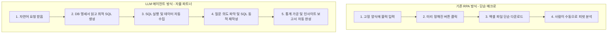

# [임원 보고용] RPA와 LLM 기반 데이터 분석 에이전트의 차이점 및 비즈니스 가치

> **"RPA는 이미 정해진 규칙대로 클릭하는 매크로이지만, LLM 에이전트는 사용자의 의도를 이해하고 상황에 맞춰 즉시 쿼리와 보고서를 만들어내는 의사결정 분석 파트너입니다."**

---

## Executive Summary: 핵심 요약

| 구분 | 단순 자동화 (RPA) | LLM 기반 자율 분석 에이전트 (AI Agent) |
|---|---|---|
| **역할 정의** | 정해진 절차를 대신 수행하는 **'자동화 도구'** | 자연어로 질의하고 인사이트를 도출하는 **'데이터 분석 파트너'** |
| **조건 변경 대처** | 조건(완전일치/부분일치 등) 변경 시 **개발자 재개발 필요** | 대화 흐름상 의도를 파악하여 **즉시 SQL 쿼리 자동 재작성** |
| **업무 처리 범위** | 화면 클릭 ➔ 단순 데이터 다운로드 | 자연어 의도 해석 ➔ SQL 자동 생성 ➔ 데이터 추출/가공 ➔ **인사이트 보고서 생성** |
| **임원 가치 제공** | 단순 반복 입력 시간 단축 (Operational Efficiency) | **실시간 데이터 기반 의사결정 지원 (Data-Driven Decision)** |

---

## 1. 실제 업무 수행 사례 비교 (Case Study: A101A 블럭 분석)

방금 진행한 **"2026년 A101A 블럭 자재 현장 분석"** 수행 과정을 예시로 비교합니다.

### 1.1 사용자의 조건 변경 시 대처 방식의 결정적 차이

* **상황**: 처음에 `A101A` 계열 전체(`LIKE 'A101A%'`)로 분석한 후, 사용자가 **"블럭 조건이 LIKE인지 완전일치(`=`)인지"** 질문함.

1. **RPA의 대처**:
   - RPA 봇은 질문의 의도를 이해할 수 없음.
   - 완전일치 조회를 하려면 개발자가 RPA 개발 툴을 열어 입력 폼, 조회 로직, 변수 처리, 엑셀 가공 스크립트를 **새로 개발 및 수정**해야 함. (최소 수시간~수일 소요)

2. **LLM 에이전트의 대처 (실제 수행 결과)**:
   - "블럭넘버 입력 시 기본 동작은 완전일치(`=`)입니다"라는 명세서 규칙을 스스로 확인.
   - 사용자의 의도가 단일 블럭 완전일치임을 파악하고 **`BLOCKNO = 'A101A'` 조건의 새로운 SQL을 수초 만에 동적 생성**.
   - 데이터 재추출(10,935건)부터 브랜드별 통계 집계, **마크다운 보고서(`docs/a101a_brand_statistics_report_2026.md`) 생성까지 단 1분 만에 자율 완수**.

---

## 2. RPA vs LLM 에이전트 비교표

| 비교 항목 | RPA (Robotic Process Automation) | LLM 기반 데이터 분석 에이전트 |
|---|---|---|
| **작업 방식** | Rule-Based (정해진 클릭/키보드 매크로) | Context-Aware (맥락과 의도 파악 기반 행동) |
| **입력 방식** | 정해진 서식/폼 데이터만 처리 가능 | 자유로운 자연어 질의 (한국어 구어체, 모호한 요청 가능) |
| **쿼리/DB 대응** | 미리 작성된 고정 SQL 실행 | DB 명세서(Schema)를 학습하여 **상황에 맞는 SQL 동적 작성** |
| **조건 변경 (예: LIKE ➔ =)** | 프로그램 코드 수정 및 재배포 필요 | **"완전일치로 다시 해줘"** 한마디로 즉시 반영 |
| **결과물 레벨** | 로우 데이터(CSV/Excel) 파일 다운로드 | 데이터 가공 + 통계 표 + **비즈니스 인사이트 및 요약 보고서** |
| **유연성/확장성** | 예외 상황 발생 시 프로세스 즉시 중단 | 예외 발생 시 원인 분석 후 **스스로 대안 쿼리 탐색/수정** |

---

## 3. 경영진(C-Level) 관점에서의 비즈니스 가치 (ROI)

### ① 개발 및 유지보수 비용의 획기적 절감
- **RPA**: 신규 조회 요구사항이나 쿼리 조건 변경이 생길 때마다 외주/자체 개발자의 공수(M/M) 지속 발생.
- **LLM 에이전트**: DB 명세서 표준화만 해두면 **현업 사용자가 자연어로 얼마든지 쿼리 조건과 분석 형태를 실시간 변경 가능**.

### ② 의사결정 속도(Speed to Insight) 대폭 향상
- 기존: 데이터 요청 ➔ IT/전산팀 쿼리 작성 ➔ 엑셀 추출 ➔ 기획팀 분석 보고서 작성 **(수일 소요)**
- LLM 에이전트: 자연어 질문 ➔ AI 쿼리 생성 및 실행 ➔ 분석 통계보고서 완성 **(수분 내 즉시 완료)**

### ③ 단순 데이터 제공을 넘어선 '인사이트 제안'
- RPA는 단순 숫자의 모음(Raw Data)만 던져주지만, LLM 에이전트는 데이터를 분석하여 **"NEX 계열이 53.5%로 대다수를 차지하며, 단일 블록 수배 시 모듈화 수준이 1.01개로 우수함"**과 같은 **비즈니스 시사점을 자동으로 제시**.

---

## 4. 결론 및 제언

> **"RPA가 단순 반복적인 손발을 대체했다면, LLM 데이터 에이전트는 데이터 분석가의 두뇌와 작성 능력까지 결합된 차세대 AI 파트너입니다."**

- 당사 PLM/ERP 시스템에 LLM 에이전트를 도입하는 것은 단순 프로세스 자동화(RPA)가 아니라, **경영진 및 현업 부서 전체가 24시간 언제든 데이터와 대화할 수 있는 '자율형 AI 분석 플랫폼'을 구축하는 것**입니다.
