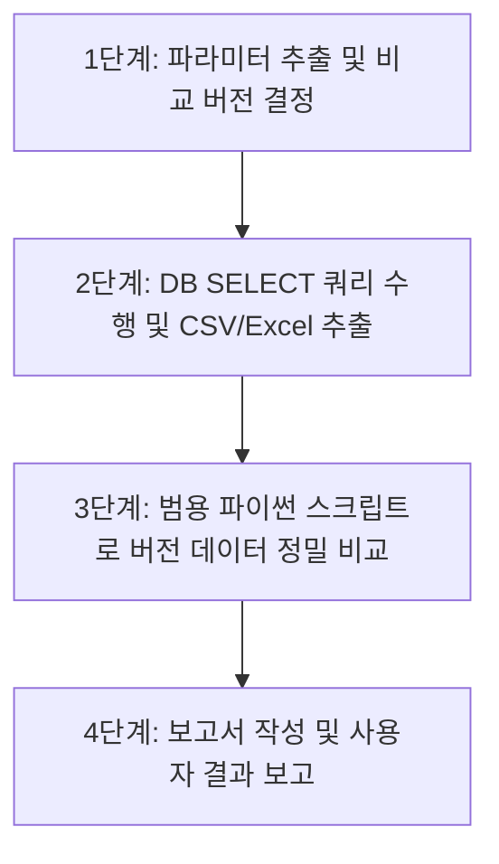

# PID 버전 비교 분석 업무수행 워크플로우 (Workflow)

## 1. 개요 및 목적
본 워크플로우는 PLM PID(Variant) 로직의 버전 간 차이점(조건, 결과, 분기, 비고 등)을 표준화된 절차로 비교 분석하고, 결과를 CSV, Excel 및 텍스트 보고서 형태로 자동 추출·보고하는 업무 가이드이다.

---

## 2. 사용자 요청 패턴

사용자가 다음과 같은 형태의 질문이나 지시를 내렸을 때 본 워크플로우를 가동한다.

1. **특정 버전 지정 비교**:
   - 예시: `B181A01 pid 28, 29버전 비교해서 분석 보고해줘`
   - 예시: `EL_PA103A pid 10버전이랑 12버전 차이점 분석해줘`
2. **버전 미지정 (최신/직전 자동 비교)**:
   - 예시: `B181A01 pid 최신 버전이랑 직전 버전 비교해줘`
   - 예시: `EL_PA103A pid 변경사항 비교 분석 보고서 만들어줘`

---

## 3. 단계별 워크플로우 (Step-by-Step Workflow)



### 1단계: 파라미터 추출 및 비교 버전 결정
1. 사용자의 요청에서 **PID명**과 **비교 버전(v1, v2)**을 확인한다.
2. 버전을 입력받지 않은 경우:
   - DB 테이블 `HDEL_DEFAULT.VARIANT_H`에서 해당 PID의 버전 목록을 조회한다.
   - 가장 최신 정수 버전(`v_latest`)과 직전 정수 버전(`v_prev`)을 비교 대상으로 자동 선택한다.

### 2단계: DB SELECT 쿼리 수행 및 CSV/Excel 추출
1. `HDEL_DEFAULT.VARIANT_D`와 `HDEL_DEFAULT.VARIANT_H` 테이블을 조인하여 선택된 두 버전의 전체 행(`NO`) 데이터를 조회한다.
2. 사내 규칙에 맞춰 `scripts/db_query` 스크립트를 호출한다:
   - **CSV 저장**: `uv run python scripts/db_query/query_to_csv.py`
     - 저장 경로: `output_csv/[PID명]_v[v1]_v[v2]_comparison.csv`
   - **Excel 저장**: `uv run python scripts/db_query/query_to_excel.py`
     - 저장 경로: `output_excel/[PID명]_v[v1]_v[v2]_comparison.xlsx`

### 3단계: 범용 파이썬 스크립트로 버전 데이터 정밀 비교
1. 범용 파이썬 비교 모듈 `src/compare_pid_versions.py`를 실행한다:
   ```bash
   uv run python src/compare_pid_versions.py --pid [PID명] --v1 [v1] --v2 [v2]
   ```
2. 라인 순서(`NO`)를 기준으로 행 단위 매칭을 진행하고 다음 차이점을 분류한다:
   - **삭제 라인**: v1에만 존재하는 행
   - **추가 라인**: v2에만 새로 추가된 행
   - **수정 라인**: 조건(`SPEC1~20`, `CON1~20`), 결과(`KEY1~20`, `VAL1~20`), 분기(`ADDR`, `GOTO`), 비고(`REMARKS`) 중 변경된 속성 추출

### 4단계: 보고서 작성 및 사용자 결과 보고
1. 차이점 분석 결과를 `docs/[PID명]_v[v1]_v[v2]_diff_report.txt` 문서로 저장한다.
2. 사용자 응답으로 다음 항목을 정리하여 전달한다:
   - **기본 정보**: PID명, 비교 버전, HOUID, 등록일자
   - **전체 행 수 및 변경 라인 수**
   - **라인별 변경 세부 내역**: 변경된 특성/컬럼 및 기존값 → 변경값 명시
   - **산출물 링크**: CSV, Excel, 파이썬 코드, 보고서 파일의 절대/상대 링크 제공

---

## 4. 관련 산출물 및 디렉터리 구조

| 산출물 종류 | 경로 | 설명 |
|---|---|---|
| **SQL 쿼리** | `scripts/db_query/` | PID 버전 조회용 SQL 스크립트 |
| **CSV 파일** | `output_csv/` | 쿼리 수행 결과 CSV |
| **Excel 파일** | `output_excel/` | 쿼리 수행 결과 Excel (xlsx) |
| **실행 코드** | `src/` | `compare_pid_versions.py` (범용 비교 스크립트) |
| **문서 보고서** | `docs/` | `[PID명]_v[v1]_v[v2]_diff_report.txt` |

---

## 5. 원칙 및 금지사항
1. **DB SELECT 전용**: 데이터 변경(`INSERT`, `UPDATE`, `DELETE`, `ALTER` 등) SQL은 일절 금지하며 `SELECT` 문만 사용한다.
2. **uv 가상환경**: 패키지 실행 및 스크립트 동작은 워크스페이스 최상위의 `.venv` 가상환경 및 `uv` 도구를 사용한다.
3. **인코딩 표준**: 모든 파일 입출력 시 `utf-8-sig` 또는 `utf-8` 인코딩을 적용하여 한글 깨짐을 방지한다.
